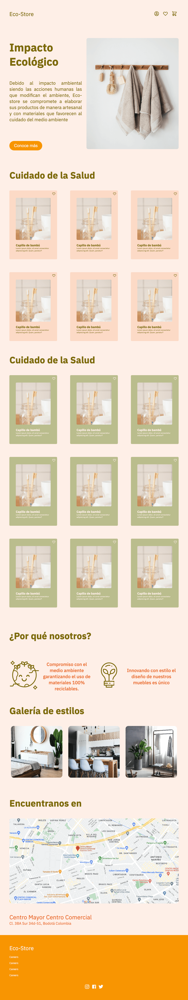
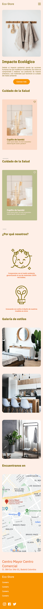

# eco-store  |   <a href="https://lupemorales.github.io/eco-store/" target="_blank">   Demo </a> | 

Eco-store is a landing page for a catalog of health care and home decoration products.

## Table of contents

- [Overview](#overview)
  - [The challenge](#the-challenge)
  - [Screenshot](#screenshot)
- [My process](#my-process)
  - [Built with](#built-with)
  - [What I learned](#what-i-learned)
  - [Useful resources](#useful-resources)
- [Contact](#contact)

## Overview

### The challenge
Use Sass to create the web page with several sessions of own styles following the design given through [Figma](https://www.figma.com/file/Em1aDiIHmqozHpUAjsYhT7/Eco-Store-Mockups-(Copy)?type=design&node-id=43-2185&t=C4wzlaOCCJExAuCe-0)

- Structure a style sheet.
- Use mixins to reuse already defined styles.
- Responsive design.
- Horizontal scroll.

### Screenshot

## My process

### Built with

- Semantic HTML5 markup
- Sass 
- Mixin
- Flexbox
- CSS Grid
- Mobile-first workflow

### What I learned

I've learned how powerful using "mixin" is and how much it helps to reuse code and keep it cleaner.

### Useful resources

- [Sass documentation](https://sass-lang.com/documentation/) 
- [How to install Sass](https://www.youtube.com/watch?v=MCbdP3E2f7s&list=PLPP5LxJ4T3ifn0VdPY_glEIJaH6B6o4fh&index=1) 

## Contact

- Website - [My portfolio web](https://lupemorales.github.io/portfolio/)
- Linkedin - [@LupeMorales](https://www.linkedin.com/in/lupe-morales/)

**Have fun coding!** 🚀